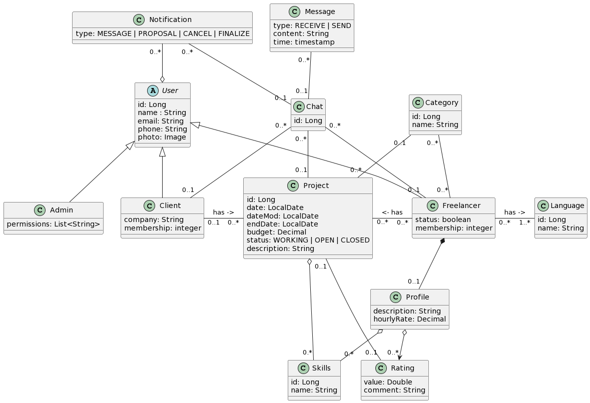

# Nome do Projeto

privatevoid

## Tecnologias

* Python
* JavaScript
* HTML/CSS
* Bootstrap

## Resumo do Projeto

O projeto propõe o desenvolvimento de uma plataforma online para freelancers, o qual visa relacionar um público-alvo composto por profissionais na área de tecnologia e clientes com projetos de baixa e média complexidade. O objetivo principal é atender as necessidades básicas de pequenas empresas, capacitando o aprimoramento de habilidades práticas do freelancer no processo.

Para clientes que buscam serviços de programação, a plataforma oferece um processo simplificado para encontrar novos talentos. Os clientes podem publicar projetos, definir seus orçamentos e especificar seus requisitos, permitindo que freelancers apresentem soluções adaptadas às necessidades do projeto. Um sistema de avaliação irá permitir que os clientes tomem decisões informadas ao selecionar freelancers.

Para os freelancers, a plataforma oferece uma forma de comercializar suas habilidades e filtrar solicitações de acordo com os parâmetros especificados. Eles podem personalizar e publicar perfis pessoais, com breves descrições e outras informações pertinentes de interesse do cliente. Após a finalização de um projeto, os freelancers receberão um feedback baseado na experiência do cliente.

A plataforma irá oferecer, entre outros recursos, um chat integrado para facilitar a comunicação e garantir o alinhamento do trabalho com a visão do cliente.

## Público-Alvo

1. *Programadores Júnior*: Este grupo inclui freelancers com diversas especializações, como Java, C#, mobile etc. Eles buscam uma plataforma que os ajude a encontrar projetos compatíveis com suas habilidades e interesses. 

2. *Clientes*: Pessoas que precisam de serviços específicos, como a sustentação de um banco de dados ou uma página web simplificada. A plataforma facilitará o processo da busca por profissionais da área.

## Dores Resolvidas

1. *Dificuldade em Encontrar Serviços ou Profissionais Confiáveis*: Muitos consumidores e empresas de pequeno porte enfrentam dificuldades para encontrar freelancers competentes. A plataforma resolverá esse problema, oferecendo acesso a uma rede de profissionais avaliados pelos clientes e disponíveis a um preço acessível.

2. *Tempo Gasto em Buscas*: A plataforma economizará tempo, permitindo que os usuários encontrem rapidamente o que precisam com base em suas preferências e requisitos. 

## Monetização

1. *Taxas de Transação*: A plataforma cobrará uma porcentagem fixa (5%) de cada transação concluída.

2. *Anúncios e publicidade*: Será reservado um espaço no site para anúncios patrocinados, com o intuito de cobrir o custo operacional da plataforma.

# Briefing Plataforma de Serviços
## Resumo: Sistema de Listagem de Serviços

- Um sistema de listagem de serviços necessita suportar os perfis dos profissionais cadastrados e os pedidos dos clientes. Dentre os comportamentos previstos, espera-se: listar os pedidos com os requisitos técnicos, listar os perfis dos potenciais freelancers, acessar o histórico de serviços, avaliar a qualidade do produto entregue, garantir o processamento do pagamento, estabelecer um link de comunicação etc.
- Nessa primeira versão será implementado um MVP (Produto Mínimo Viável), dessa forma, atender somente às necessidades do MVP.
- Novas funcionalidades poderão ser implementadas em versões futuras, à medida que o projeto seja devidamente validado.

## Requisitos da primeira versão (MVP)

 - Clientes e freelancers podem se cadastrar na plataforma com informações básicas, como nome, e-mail e senha.
 - O freelancer deverá assumir seu papel como profissional para se diferenciar do papel do cliente.
 - Usuários cadastrados no sistema passarão por um processo de verificação via e-mail ou telefone.
 - Clientes podem pesquisar serviços com base em critérios como avaliações, linguagens de programação ou preço.
 - O cliente publica o projeto, descrevendo as suas necessidades e orçamento estimado (total ou por hora).
 - O sistema de pagamento utilizará coins pré-pagas para padronizar a unidade de cotação.
 - O freelancer publica seu perfil com uma breve descrição de suas habilidades e estimativas quanto ao preço do serviço. Ele pode demonstrar interesse nos projetos publicados pelos clientes.
 - Após a escolha do freelancer apropriado, o freelancer será notificado para confirmar os termos do projeto.
 - Caso o procedimento continue, uma quantia parcial (garantia) será retida pela plataforma para o pagamento do freelancer e a transação será registrada no sistema.
 - O sistema oferece um chat para a comunicação eficiente entre os atores envolvidos.
 - Tanto o cliente quanto o freelancer têm a opção de cancelar o serviço. Entretanto, caso não seja realizado um acordo mútuo entre as partes, um moderador pode ser requisitado para arbitrar a disputa quanto aos danos envolvidos.
 - Após a conclusão do serviço, o cliente avalia aspectos relacionados ao projeto, como qualidade e usabilidade do produto entregue em níveis pré-definidos. Caso convenha, o cliente tem a opção de enviar um feedback para a exposição no perfil do freelancer.
 - Os projetos finalizados serão listados automaticamente no portfólio do freelancer.
   
## Observações:

 - Manutenção do tipo de projeto (mobile, frontend, backend, dados etc.) e tecnologia associada (PHP, C# etc.).
 - Manutenção de clientes: Nome, telefone, e-mail, empresa afiliada (opcional) e data de nascimento.
 - Manutenção de freelancers: Nome, telefone, e-mail, data de nascimento, descrição de habilidades técnicas, portfólio de projetos, preço por hora e comentários.
 - Manutenção da disponilidade do profissional.
    - O freelancer, caso não exercite atividade na conta em um período de 1 ano, será desativado pelo sistema para facilitar a manutenção de perfis.
    - Os usuários tem a opção de desativar a sua conta manualmente, desde que não estejam ativos em um projeto atual.
 - O projeto deverá ter: cliente, proposta de software, categoria, tecnologias utilizadas, descrição, orçamento, estimativa de entrega e status (aberto, concluído, em desenvolvimento).
    -  É necessário que o freelancer confirme o interesse no projeto dentro de 7 dias após a solicitação do cliente.
 - Listar o histórico de projetos de um cliente e freelancer.

## Três perfis:

- Cliente:
  - Permite buscar e visualizar serviços oferecidos pelos freelancers.
  - Permite solicitar serviços de freelancers disponíveis.
  - Permite visualizar e gerenciar seus projetos.
  - Permite avaliar e deixar comentários sobre os serviços prestados.
  - Permite trocar mensagens com os freelancers para esclarecimento de dúvidas.
  - Permite atualizar dados específicos de seu perfil, incluindo informações pessoais e preferências.
    
- Freelancer:
  - Permite listar as suas habilidades técnicas, incluindo detalhes, preços e disponibilidade.
  - Permite visualizar solicitações de projetos e confirmar ou rejeitar tais solicitações.
  - Permite gerenciar seus projetos.
  - Permite trocar mensagens com os clientes para esclarecimento de dúvidas e detalhes do serviço.
  - Permite atualizar dados específicos seu próprio perfil, incluindo o seu portfólio.

- Administrador:
  - Permite gerenciar os filtros dos projetos.
  - Permite adicionar, editar ou remover informações de profissionais.
  - Permite acesso a ferramentas de moderação e gerenciamento de conteúdo.
  - Permite mediar a relação entre o cliente e freelancer, caso requisitado.
  
## Responsividade
- Ter o layout correto para larguras de tela com 350px ou mais.
- Não considerar larguras menores que 350px.

# Diagramas:

### Caso de Usos:

### Modelo Conceitual:

